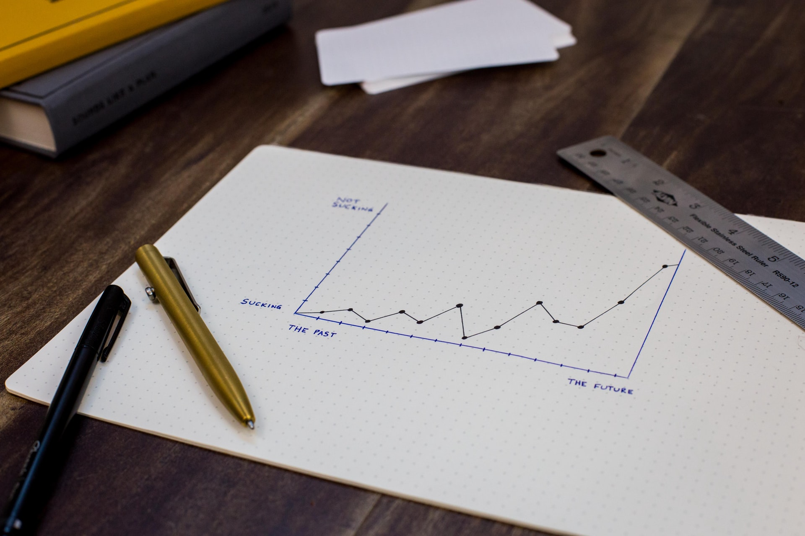

<!-- https://evamaerey.github.io/flipbooks/flipbook_recipes#49 -->

```{r setup, include=FALSE}
knitr::opts_chunk$set(
  echo = TRUE,
  dev = "svg",
  message = FALSE,
  cache = TRUE,
  fig.align = "center",
  fig.height = 4
)

knitr::knit_hooks$set(crop = knitr::hook_pdfcrop)

options(htmltools.dir.version = FALSE, warn = -1)

# names(xaringan:::list_css())

# renv::install("rstudio/fontawesome")
# renv::install("gadenbuie/xaringanExtra")
# renv::install("ropensci/rnaturalearthdata")
# renv::install("ropensci/rnaturalearthhires")
# renv::install("clauswilke/colorblindr")

library(tidyverse)
library(ggpmthemes)
library(patchwork)
library(flipbookr)
library(fontawesome)
library(palmerpenguins)
library(sf)
library(rnaturalearth)
library(ragg)

theme_set(theme_light_modified(base_family = "Montserrat"))

theme_update(
  panel.border = element_blank(),
  axis.ticks = element_blank(),
  strip.background = element_blank()
)

htmltools::tagList(rmarkdown::html_dependency_font_awesome())
```

```{r xaringanExtra, echo=FALSE}
xaringanExtra::use_xaringan_extra(
  c(
    "tile_view",
    "animate_css",
    "tachyons"
  )
)
xaringanExtra::use_broadcast()
# xaringanExtra::use_clipboard()
# xaringanExtra::use_share_again()

```

```{r xaringanExtra-clipboard, echo=FALSE}
htmltools::tagList(
  xaringanExtra::use_clipboard(
    button_text = "<i>Copy</i>",
    success_text = "<i class=\"fa fa-check\" style=\"color: #90BE6D\"></i>",
    error_text = "<i class=\"fa fa-times-circle\" style=\"color: #F94144\"></i>"
  ),
  rmarkdown::html_dependency_font_awesome()
)
```

```{r xaringan-animate-all, echo=FALSE}
# xaringanExtra::use_animate_all("fade")
xaringanExtra::use_tachyons()
# xaringanExtra::use_text_poster()
```

class: title-slide, center, bottom

# `r rmarkdown::metadata$title`

<figure>
  
</figure>

May 19, 2022 (updated: `r Sys.Date()`)

## `r rmarkdown::metadata$author`

---

name: hello
class: middle, center, inverse


<b>Research assistant at Takuvik (Laval University)</b><br>

<center>
<figure>
  
</figure>
</center>

<small>*Remote sensing, modelling, data science, data visualization*</small><br>

[`r fontawesome::fa("github")` @pmassicotte](https://github.com/PMassicotte)    
[`r fontawesome::fa("twitter")` @philmassicotte](https://twitter.com/apreshill)   
[`r fontawesome::fa("link")` www.pmassicotte.com](https://www.pmassicotte.com)

---

# Outline

- Brief introduction to data visualization
  - General advice to make graphics

- `ggplot2` basic plots
    - Histograms and bar plots
    - Points and lines plots
    - Boxplots

- `ggplot2` aesthetics and appearance
    - Color, size
    - Axes and titles
    - Faceting (small multiples)
    - Overview of the `theme()` function

---

# Not covered today

- Data importation
  - `readr` - https://r4ds.had.co.nz/data-import.html
  - `readxl` - https://readxl.tidyverse.org/

- Data manipulation and transformation
  - `dplyr`, `tidyr` - https://r4ds.had.co.nz/tidy-data.html
  - `data.table` - https://rdatatable.gitlab.io/data.table/

- Data visualization theory
  - [Fundamentals of Data Visualization](https://clauswilke.com/dataviz/)
  - [What to consider when choosing colors for data visualization](https://blog.datawrapper.de/colors/)
  - [What to consider when visualizing data for colorblind readers](https://blog.datawrapper.de/colorblindness-part2/)
  - [Choosing Color Palettes for Data Visualization That Are Accessible for Most Audiences](https://www.youtube.com/watch?v=PstHyodalWg)

---

# Data visualization

<center>
<figure>
  
<figcaption>Artwork by <a href="https://twitter.com/allison_horst?s=20">@allison_horst</a></figcaption>
</figure>
</center>

---

# Data visualization

--

- An important aspect of data sciences:
    - **Communicate information clearly and efficiently to the community.**

--

- Powerful tool to discover patterns in the data:
    - It makes complex data more accessible: **reveal the data**.

--

- Bad graphics can be a reason for paper rejection:
    - **Readers should rapidly understand the message you are trying to convey.**

--

- A picture is worth a thousand words:
    - **Always, always, always plot your data!**
    - When possible, replace tables with figures.

---

# Visualization to convey your message

It can be difficult to grasp the information contained in a table.

.pull-left[
```{r, echo = FALSE}
file <- "ftp://sidads.colorado.edu/DATASETS/NOAA/G02135/north/daily/data/N_seaice_extent_daily_v3.0.csv"

raw_data <- curl::curl_fetch_memory(file)

sea_ice_extent <- rawToChar(raw_data$content)

sea_ice_extent <- sea_ice_extent %>%
  read_csv(
    skip = 2,
    col_names = c("year", "month", "day", "extent", "missing", "source")
  ) %>%
  dplyr::select(year:extent) %>%
  mutate(month = parse_number(month)) %>%
  mutate(month2 = month.name[month]) %>%
  mutate(month2 = factor(month2, month.name))

sea_ice_extent %>%
  head(10) %>%
  transmute(date = lubridate::make_date(year, month, day), extent) %>%
  knitr::kable(caption = "Sea ice extent in the Arctic between 1978 and 2021.") %>%
  kableExtra::kable_styling(font_size = 18, full_width = TRUE) %>%
  kableExtra::column_spec(column = 1:2, width = "3in")
```
]

.pull-right[
<center>
    
</center>
]

<small>
[Data from NSIDC](ftp://sidads.colorado.edu/DATASETS/NOAA/G02135/north/daily/data/N_seaice_extent_daily_v3.0.csv)
</small>

---

# Visualization to convey your message

Graphics, on the other hand, can help to convey your message.

```{r, echo = FALSE, fig.width = 10, fig.height=6, out.width="70%"}

sea_ice_extent %>%
  group_by(month2, year) %>%
  summarise(extent = mean(extent)) %>%
  ggplot(aes(x = year, y = extent)) +
  geom_point(color = "#5c5c5c", size = 2) +
  facet_wrap(~month2, scales = "free_y") +
  geom_smooth(method = "lm", se = FALSE) +
  xlab(NULL) +
  ylab(quote("Sea ice extent" ~ (km^2 %*% 10^6))) +
  labs(
    title = sprintf(
      "Arctic sea ice extent between %d and %d",
      min(sea_ice_extent$year),
      max(sea_ice_extent$year)
    ),
    caption = paste("Source:", file)
  ) +
  theme(
    plot.caption = element_text(size = 8, color = "gray50"),
    plot.margin = unit(c(5.5, 10, 5.5, 5.5), "points"),
    strip.background = element_blank(),
    strip.text = element_text(face = "bold", size = 14, hjust = 0),
    axis.ticks = element_blank()
  )
```

---

# Visualization to convey your message

The same data but presented differently.

```{r, echo = FALSE}
df_viz <- sea_ice_extent %>%
  mutate(date = lubridate::make_date("2020", month, day)) %>% 
  filter(year <= 2021)

sea_ice_extent_2021 <- df_viz %>%
  filter(year == 2021)

df_viz %>%
  ggplot(aes(x = date, y = extent, group = year)) +
  geom_line(size = 0.25, color = "gray85") +
  geom_line(data = sea_ice_extent_2021, aes(color = "2021"), size = 0.5) +
  stat_summary(
    fun.y = median,
    geom = "line",
    lwd = 1,
    aes(group = 1, color = "Median 1978-2021")
  ) +
  scale_x_date(date_labels = "%B") +
  scale_color_manual(
    breaks = c("2021", "Median 1978-2021"),
    values = c("red", "black")
  ) +
  labs(
    x = NULL,
    y = quote("Sea ice extent" ~ (km^2 %*% 10^6)),
    caption = paste("Source:", file)
  ) +
  theme(
    plot.caption = element_text(size = 8, color = "gray50"),
    axis.ticks = element_blank(),
    legend.title = element_blank(),
    legend.justification = c(0, 0),
    legend.position = c(0.1, 0.1)
  )
```

Interesting reading: [Arctic Sea Ice Extent Second Highest in 18 Years at the end of 2021](https://www.severe-weather.eu/global-weather/arctic-sea-ice-second-highest-18-years-end-2021-rrc/)

---

# Datasaurus Dozen

```{r, echo = FALSE}
# renv::install("lockedata/datasauRus")
library(datasauRus)

datasaurus_dozen %>%
  ggplot(aes(x, y)) +
  geom_point(aes(color = dataset), show.legend = FALSE) +
  facet_wrap(~dataset, ncol = 5) +
  labs(
    x = NULL,
    y = NULL
  ) +
  theme(
    strip.background = element_blank(),
    panel.border = element_blank(),
    axis.ticks = element_blank()
  )
```

--

**These 13 datasets have the same statistical properties (*mean*, *variance*, *correlation*).** However, they look quite different!

---

class: inverse, center, middle

# The anatomy of misleading graphs

<center>
    <figure>
      
    </figure>
    <figcaption>Photo by <a href="https://unsplash.com/@isaacmsmith?utm_source=unsplash&utm_medium=referral&utm_content=creditCopyText">Isaac Smith</a> on <a href="https://unsplash.com/s/photos/graph?utm_source=unsplash&utm_medium=referral&utm_content=creditCopyText">Unsplash</a>
    </figcaption> 
</center>

---

# The anatomy of misleading graphs

> In statistics, a misleading graph, also known as a distorted graph, is a graph that misrepresents data, constituting a misuse of statistics and with the result that an incorrect conclusion may be derived from it (Wikipedia).

--

- Defining what makes a good graph can be subjective to a certain extent.

--

- Nevertheless, there are a couple of elements that characterize misleading/bad graphs:

  - Improper axis scaling

  - Truncated graphs

  - Unnecessary use of 3D
  
  - Bad choice of colours

---

## The good, the bad and the ugly of data viz

There are many resources online that provide advice for making good graphs and avoiding pitfalls:

- [Data is ugly](https://www.reddit.com/r/dataisugly/)

- [Data Visualization Examples: Good, Bad and Misleading](https://www.syntaxtechs.com/blog/data-visualization-examples)

- [10 good and bad examples of data visualization](https://www.polymersearch.com/blog/10-good-and-bad-examples-of-data-visualization)

- [15 Misleading Data Visualization Examples](https://rigorousthemes.com/blog/misleading-data-visualization-examples/)

---

## Did Apple presented a misleading graph?

Back in 2013, Tim Cook presented this chart showing cumulative iPhone sales.

<center>
<figure>
  
</figure>
<figcaption>Credit: <a href="https://qz.com/122921/the-chart-tim-cook-doesnt-want-you-to-see/">https://qz.com/</a> 
</figcaption> 
</center>

---

## Did Apple presented a misleading graph?

> Using data from Apple’s own quarterly reports filed with the Securities and Exchange Commission, I made a better chart.

<center>
<figure>
  
</figure>
<figcaption>Credit: <a href="https://qz.com/122921/the-chart-tim-cook-doesnt-want-you-to-see/">https://qz.com/</a> 
</figcaption> 
</center>

---

# Exaggerating variations

- It is easy to exaggerate variation in the data by manipulating the range of an axis.

- In this example, changing the maximum of the **y-axis** in panel **B** suggests that the increase is less steep than in **A**.

```{r, echo=FALSE, fig.width=9, fig.height=4}
set.seed(1234)

x <- seq(1, 100, length.out = 100)
y <- 200 + 2 * x + rnorm(x, sd = 30)

df <- data.frame(x = x, y = y)

p1 <- ggplot(df, aes(x = x, y = y)) +
  geom_point() +
  geom_smooth(method = "lm")

p2 <- ggplot(df, aes(x = x, y = y)) +
  geom_point() +
  geom_smooth(method = "lm") +
  ylim(0, 900)

p1 + p2 +
  plot_annotation(tag_level = "A") &
  theme(plot.tag = element_text(face = "bold"))
```

---

# Aspect ratio

These three graphs show the same data with different aspect ratios which considerably influences the visual perception.

```{r, echo=FALSE, fig.width=9, fig.height=4}

pa <- p1 + 
  labs(title = "Ratio 1:1") + 
  theme(plot.title = element_text(size = 12))

pb <- p1 + 
  labs(title = "Ratio 2:1") + 
  theme(plot.title = element_text(size = 12))

pc <- p1 + 
  labs(title = "Ratio 4:1") + 
  theme(plot.title = element_text(size = 12))

pa + pb + pc +
  plot_layout(widths = c(1, 0.5, 0.25)) +
  plot_annotation(tag_level = "A") &
  theme(plot.tag = element_text(face = "bold"))
```

---

# Aspect ratio

.pull-left[
- Choosing the appropriate aspect ratio for the data can help to distinguish certain features. 

- To illustrate it, we will use **yearly sunspot numbers from 1700-1988** (data: [WDC-SILSO, Royal Observatory of Belgium](http://www.sidc.be/silso/datafiles)).

- Examples and advice stole from https://graphworkflow.com/enhancement/aspect/.
]

.pull-right[
<center>
    <figure>
      
    </figure>
    <figcaption>Photo by <a href="https://unsplash.com/@nasa?utm_source=unsplash&utm_medium=referral&utm_content=creditCopyText">NASA</a> on <a href="https://unsplash.com/s/photos/sun?utm_source=unsplash&utm_medium=referral&utm_content=creditCopyText">Unsplash</a>
  
    </figcaption> 
</center>
]

---

# Aspect ratio

On the following graph, we can observe what seems to be a solar cycle of sunspot activity repeated every 11-13 years.

```{r sunspot1, echo=FALSE}
df <- timetk::tk_tbl(sunspot.year) %>% 
  rename(year = index, sunspot = value)

m <- ggplot(df, aes(x = year, y = sunspot)) +
  geom_line() +
  labs(
    x = NULL,
    y = "Number of sunspots"
  )

m
```

---

# Aspect ratio

Using a very wide aspect ratio reveals an interesting pattern.

```{r sunspot2, echo=FALSE, crop = TRUE, dev='ragg_png', dpi=300}
ratio <- ggthemes:::bank_slopes(df$year, df$sunspot)

m2 <- m +
  coord_fixed(ratio = ratio) +
  theme(text = element_text(size = 6))

m2
```

--

**Sunspot cycles increase more rapidly than they decrease when the number of sunspots is higher.**

```{r sunspot3, echo=FALSE, crop = TRUE, dev='ragg_png', dpi=300}
# Highlight sunspot increase and decrease segments on the graph

sunspot_high <- df %>% 
  filter(between(year, 1784, 1798)) %>% 
  mutate(orientation = case_when(
    year <= 1787 ~ "Rising",
    TRUE ~ "Faling"
  ))

sunspot_low <- df %>% 
  filter(between(year, 1878, 1890)) %>% 
  mutate(orientation = case_when(
    year < 1883 ~ "Rising",
    TRUE ~ "Faling"
  ))

ggplot(df, aes(x = year, y = sunspot)) +
  geom_line(color = "gray75") +
  labs(
    x = NULL,
    y = "Number of sunspots"
  ) +
  geom_line(
    data = sunspot_high,
    aes(x = year, y = sunspot, color = orientation)
  ) +
  geom_line(
    data = sunspot_low,
    aes(x = year, y = sunspot, color = orientation)
  ) +
  coord_fixed(ratio = ratio) +
  theme(text = element_text(size = 6)) +
  theme(
    legend.position = "none"
  )

```

--

Although we can see the different types of cycles better, the graph looks too stretched.

---

# Aspect ratio

**A better option consists to split the data into subsets.** Here, each panel presents the data for a specific century.

```{r sunspot4, echo=FALSE, crop = TRUE, dev='ragg_png', dpi=300, fig.width=8, fig.height=8, out.width="50%"}
df_viz <- df %>%
  mutate(century = year %/% 100 * 100)

tmp <- df_viz %>% 
  filter(century == 1700)

ratio <- ggthemes:::bank_slopes(tmp$year, tmp$sunspot)

make_plot <- function(df, century, ratio) {
  df %>%
    filter(century == {{ century }}) %>%
    ggplot(aes(x = year, y = sunspot)) +
    geom_line() +
    scale_x_continuous(limits = c(century, century + 100)) +
    scale_y_continuous(limits = c(0, max(df$sunspot))) +
    labs(
      x = NULL,
      y = "Number of sunspots",
      title = paste0(century, "'s")
    ) + 
    coord_fixed(ratio = ratio) +
    theme(
      plot.title = element_text(size = 14)
    )
}

p1 <- make_plot(df_viz, 1700, ratio)
p2 <- make_plot(df_viz, 1800, ratio)
p3 <- make_plot(df_viz, 1900, ratio)

p1 / p2 / p3
  
```

---

# Truncated graphs

- Truncated graphs can be very misleading because the *y-axis* does not start at 0.

- The graph in **panel A** suggests that Olivier's salary  **is 10 times more** than Benjamin's.

```{r, echo=FALSE, fig.width=9, fig.height=4}
df <-
  tibble(
    employee = c("Benjamin", "Olivier"),
    salary = c(55000, 58000)
  )

p1 <- df %>%
  ggplot(aes(x = employee, y = salary)) +
  geom_col() +
  scale_y_continuous(
    limits = c(55000, 60000),
    oob = scales::rescale_none,
    labels = scales::label_dollar()
  ) +
  labs(
    x = NULL,
    y = "Annual salary"
  )

p2 <- p1 + 
  scale_y_continuous(labels = scales::label_dollar()) 

p1 + p2 +
  plot_annotation(tag_level = "A") &
  theme(plot.tag = element_text(face = "bold"))
```

---

# Unnecessary use of 3D

- 3D graphics are very rarely useful:
  - First, they break the data-to-ink ratio rule (*more about that in a moment*).
  - Secondly, they can distort the reality.

- On the left graph, the visual perspective suggests that **Item C** is as large as **Item A**, whereas in fact, **Item A** is two times bigger than **Item C**.

.pull-left[
<center>
<figure>
  
</figure>
<figcaption>Credit: Wikipedia</figcaption>
</center>
]

.pull-right[
<center>
<figure>
  
</figure>
<figcaption>Credit: Wikipedia</figcaption>
</center>
]

---

# Improper axe scaling

- There is nothing wrong to use a logarithm scaling (I do it very often), but be careful to annotate the axis adequately, so the viewer is aware of it.
  - **If not clearly specified, the user may assume that the data is presented on a linear scale.**

- On a `log10` scale, a difference of 1 unit, represents 1 order magnitude.

```{r echo=FALSE, fig.width=9, fig.height=4, out.width="70%"}
df <- tibble(x = 0:10, y = 2^x)
p1 <- df %>% 
  ggplot(aes(x = x, y = y)) +
  geom_line() +
  geom_point()

p2 <- p1 +
  scale_y_log10() +
  annotation_logticks(sides = "l", size = 0.2)

p1 + p2 +
  plot_annotation(tag_level = "A") &
  theme(plot.tag = element_text(face = "bold"))
```

---

# Data-ink ratio

The data-ink ratio is the proportion of ink that is used to present actual data compared to the total amount of ink used in the entire display.

<br>

$$
\verb|data-ink ratio| = \frac{\verb|Data-ink|}{\verb|Total ink used to print the graphic|}
$$

<br>

The data-to-ink ratio should be kept as high as possible.

---

# Data-ink ratio

Here, both graphs contain the same data. However, the grey background in **panel A** is unnecessary.

```{r, echo = FALSE, fig.width=9, fig.height=4}
df <- data.frame(x = 1:4, y = 1:4)

p2 <- ggplot(df, aes(x, y)) +
  geom_col()

p1 <- p2 +
  theme(panel.background = element_rect(fill = "gray"))

p1 + p2 +
  plot_annotation(tag_level = "A") &
  theme(plot.tag = element_text(face = "bold"))
```

---

# Further resources

- There are plenty of resources online about **the do's and don'ts** of data visualization. 

- Recommended reading: [Fundamentals of Data Visualization](https://clauswilke.com/dataviz/index.html) (freely available online).

<center>

</center>

---

class: inverse, center, middle

<center>
<figure>
  
<figcaption>Artwork by <a href="https://twitter.com/allison_horst?s=20">@allison_horst</a></figcaption>
</figure>
</center>

---

# ggplot2

`ggplot2` is a system for declaratively creating graphics, based on [The Grammar of Graphics](https://amzn.to/2ef1eWp).

> Presents a unique foundation for producing almost every quantitative graphic found in scientific journals, newspapers, statistical packages, and data visualization systems.

<center>
<figure>
  
<figcaption>Source: <a href="https://bit.ly/3JwHavs">Thomas de Beus</a></figcaption>
</figure>
</center>

---

# ggplot2

`ggplot2` is not part of base R, so it needs to be installed.

.left-column[
<center>
<figure>
  
</figure>
</center>
]

.right-column[

```{r, eval = FALSE}
install.packages("ggplot2")
```

After the installation, you will have to load it.

```{r, eval = FALSE}
library(ggplot2)
```
]

---

# ggplot2

.column-left[
- `ggplot2` is a very powerful tool. 

- The learning curve can be difficult, but **the time investment will eventually pay off.**
]

.column-right[
<center>
<figure>
  
    <figcaption>
    Artwork by <a href="https://twitter.com/allison_horst?s=20">@allison_horst</a>
    </figcaption>
</figure>
</center>
]

---

# TidyTuesday

TidyTuesday is a weekly challenge where people use (mostly) `ggplot2` to explore a new dataset.

> A weekly data project aimed at the R ecosystem. As this project was borne out of the R4DS Online Learning Community and the R for Data Science textbook, an emphasis was placed on understanding how to summarize and arrange data to make meaningful charts with `ggplot2`, `tidyr`, `dplyr`, and other tools in the `tidyverse` ecosystem.

<center>
    
    <figcaption>
    <a href="https://twitter.com/search?q=%23TidyTuesday&src=hashtag_click">#TidyTuesday on <i class="fab fa-twitter"></i></a>
    </figcaption>
</center>

---

# TidyTuesday

As already said, `ggplot2` can be intimidating at first. However, with some practice, you will be able to make stunning graphics.

<center>
<div class="row">
    <div class="column">
        
        <figcaption>
            Graphic by <a href=https://twitter.com/loreabad6>@loreabad6</a>
        </figcaption>
    </div>
    <div class="column">
        
        <figcaption>
            Graphic by <a href=https://twitter.com/jakekaupp">@jakekaupp</a>
        </figcaption>
    </div>
    <div class="column">
        
        <figcaption>
            Graphic by <a href=https://twitter.com/geokaramanis?lang=en">@geokaramanis</a>
        </figcaption>
    </div>
</div>
</center>

**Most people participating in the TidyTuesday challenges share their code on Github. It is a great way to learn more advanced techniques!**

---

class: inverse, center, middle

# Let's start with ggplot2!

---

# Different types of visualizations

There are many types of visualization to choose from to present data. The decision depends on the data itself and how you want to present it to your audience.

<center>
    
    <figcaption>
    <a href="https://www.kdnuggets.com/2019/03/how-choose-right-chart-type.html">How to Choose the Right Chart Type</a>
    </figcaption>
</center>

---

# The Palmer Penguins: the new iris

Data were collected and made available by [Dr. Kristen Gorman](https://www.uaf.edu/cfos/people/faculty/detail/kristen-gorman.php) and the [Palmer Station, Antarctica LTER](https://pal.lternet.edu/), a member of the [Long Term Ecological Research Network](https://lternet.edu/). 

<center>
<figure>
  
</figure>
<figcaption>
    Artwork by <a href="https://twitter.com/allison_horst?s=20">@allison_horst</a>
</figcaption>
</center>

---

# The Palmer Penguins

The dataset contain data for **344 penguins** from **3 different species** (<pu><b>Chinstrap</b></pu>, <cy><b>Gentoo</b></cy> and <or><b>Adélie</b></or>) collected from **3 islands** in the Palmer Archipelago, Antarctica.

<small>
.pull-left[

- `species`: penguin species (*Adélie*, *Chinstrap* and *Gentoo*)

- `island`: island in Palmer Archipelago, Antarctica (*Biscoe*, *Dream* and *Torgersen*)

- `bill_length_mm`: bill length (millimeters)

- `bill_depth_mm`: bill depth (millimeters)

- `flipper_length_mm`: flipper length (millimeters)

- `body_mass_g`: body mass (grams)

- `sex`: penguin sex (*female*, *male*)

- `year`: year of the study (2007, 2008 and 2009)

]
</small>

.pull-right[
<center>
<figure>
  
</figure>
</center>
]

---

# Installing the data

.left-column[
<center>
<figure>
  
</figure>
</center>
]

.right-column[
You can install the data as follow:

```{r, eval = FALSE}
# install.packages("remotes")
remotes::install_github("allisonhorst/palmerpenguins")
```
]

---

# The palmer penguins data

<small>
```{r}
library(palmerpenguins)
penguins
```
</small>

---

# Understanding the ggplot2 syntax

A `ggplot2` plot is built layer by layer by using the `+` operator. 

<center>
    
</center>
<figcaption>
    The basic structure of a ggplot2 plot.
</figcaption>
        
---

# The geoms 

`geoms` is the abbreviation for *geometric objects* which are used to specify which type of graphic you want to produce (**boxplot**, **barplot**, **scatterplot**, **histogram**, ...). All `ggplot2` geoms start with the `geom_` prefix.

<small>
```{r, echo = FALSE}
ls(pattern = "^geom_", env = as.environment("package:ggplot2"))
```
</small>

---

class: inverse, center, middle

# One variable graphics

---

# One variable graphics

In this section, we are going to see the two main types of one variable graphics:

| **Graphic type** | **Geom**           | **Description**                          |
| ---------------- | ------------------ | ---------------------------------------- |
| Histogram        | `geom_histogram()` | Produces histograms for continuous data. |
| Barplot          | `geom_bar()`       | Produces histograms for discrete data.   |


```{r histogram1, include = FALSE, warning=FALSE}
ggplot(
  data = penguins,
  mapping = aes(x = body_mass_g)
) +
  geom_histogram()
```

---

`r chunk_reveal(chunk_name = "histogram1", title = "# Histogram")`

---

```{r barplot1, include=FALSE}
ggplot(
  data = penguins,
  mapping = aes(x = island)
) +
  geom_bar()
```

`r chunk_reveal(chunk_name = "barplot1", title = "# Barplot")`

---

class: inverse, center, middle

# Two variables graphics

---

# Two variables graphics

There are several types of charts with two variables. Here are the most used.

| **Graphic type** | **Geom**         | **Description**                                               |
| ---------------- | ---------------- | ------------------------------------------------------------- |
| Barplot          | `geom_col()`     | Produces bars with heights that represent values in the data. |
| Scatter plot     | `geom_point()`   | Produces scatter plot between `x` and `y`.                    |
| Line plot        | `geom_line()`    | Produces line plot between `x` and `y`.                       |
| Boxplot          | `geom_boxplot()` | Boxplot between `x` and `y`.                                  |

---

# Barplot

We used `geom_bar()` to visualize the number/count of cases for each value of `x`. If we want to represent values in the data (`y`), we can use `geom_col()`. For this example, I will use the `starwars` data that is included in the `dplyr` package. **This graph shows the top 20 tallest characters (in cm).**

```{r, echo=FALSE}
sw <- starwars %>% 
  slice_max(height, n =  20)
```

.pull-left[
```{r barplot2, eval=FALSE}
ggplot(
  data = sw,
  mapping = aes(
    x = name,    #<<
    y = height   #<<
  )
) +
  geom_col()
```
]

.pull-right[
```{r ref.label="barplot2", echo=FALSE}

```
]

--

**What could be done to improve this graph?**

---

# Barplot

In the previous graph, it was difficult to read the names on the `x-axis`. **A better way to present the data is by swapping the `x` and `y` axes.**

--

.pull-left[
```{r barplot3, eval=FALSE}
ggplot(
  data = sw,
  mapping = aes(
    x = height,  #<<
    y = name     #<<
  )
) +
  geom_col()
```
]

.pull-right[
```{r ref.label="barplot3", echo=FALSE}

```
]

--

**Can we improve furthermore?**

---

# Ordering things

We have made some improvements in the previous graph by swapping the axes. However, **it would be even better if the characters were sorted by their height** to make the plot easier to understand. 

--

One way to do it is with `forcats::fct_reorder()`. Note that the `forcats` library is not part of base R and must be installed separately.

--

.pull-left[
<small>
```{r barplot4, eval=FALSE}
ggplot(
  data = sw,
  mapping = aes(
    x = height,
    y = forcats::fct_reorder(name, height)  #<<
  )
) +
  geom_col()
```
</small>
]

--

.pull-right[
```{r ref.label="barplot4", echo=FALSE}

```
]

---

```{r scatterplot1, include = FALSE}
ggplot(
  penguins,
  aes(
    x = bill_length_mm,
    y = body_mass_g
  )
) +
  geom_point()
```

`r chunk_reveal(chunk_name = "scatterplot1", title = "# Scatter plot")`

---

# Adding a regression line

Use `geom_smooth(method = "lm")` to add a linear regression line to your data.

.pull-left[
<small>
```{r geom-smooth-1, eval=FALSE}
ggplot(
  penguins,
  aes(
    x = bill_length_mm,
    y = body_mass_g
  )
) +
  geom_point()+
  geom_smooth(method = "lm") #<<
```
</small>
]

.pull-right[
```{r ref.label="geom-smooth-1", echo=FALSE}

```
]

---

# Adding a smoothing line

If the argument `method` is not specified, a `loess` or a `gam` model will be used (depending on the number of points to be fitted).

.pull-left[
<small>
```{r geom-smooth-2, eval=FALSE}
ggplot(
  penguins,
  aes(
    x = bill_length_mm,
    y = body_mass_g
  )
) +
  geom_point()+
  geom_smooth() #<<
```
</small>
]

.pull-right[
```{r ref.label="geom-smooth-2", echo=FALSE}

```
]

---

```{r lineplot1, include = FALSE}
ggplot(
  penguins,
  aes(
    x = bill_length_mm,
    y = body_mass_g
  )
) +
  geom_line()
```

`r chunk_reveal(chunk_name = "lineplot1", title = "# Line plot")`

---

# Boxplot

> In descriptive statistics, a box plot or boxplot is a convenient way of graphically depicting groups of numerical data through their quartiles (Wikipedia).

To make a boxplot, we need to have a **discrete/categorical** variable on `x` and a **continuous** variable on `y`.

---

```{r boxplot1, include = FALSE}
ggplot(
  data = penguins,
  mapping = aes(
    x = island,
    y = body_mass_g
  )
) +
  geom_boxplot()
```

`r chunk_reveal(chunk_name = "boxplot1", title = "# Boxplot")`

---

# Boxplot

We can reorder the `island` variable based on the `body_mass_g` variable to make the graphic more appealing with `forcats::fct_reorder()`.

--

.pull-left[
<small>
```{r boxplot-ordered, eval=FALSE}
ggplot(
  data = penguins,
  mapping = aes(
    x = forcats::fct_reorder( #<<
      island, #<<
      body_mass_g, #<<
      na.rm = TRUE #<<
    ), #<<
    y = body_mass_g 
  )
) +
  geom_boxplot()
```
</small>
]

--

.pull-right[
```{r ref.label="boxplot-ordered", echo=FALSE}

```
]

Note the use of `na.rm = TRUE` in the `fct_reorder()` function.

---

class: inverse, center, middle

# Geom aesthetics

---

# Geom aesthetics

Aesthetics such as *colour*, *shape*, *size* of the displayed geoms can be controlled inside the `geom_()` functions. For example, we can change the `color` and the `size` of the point in the `geom_point()` function.

```{r eval = FALSE}
# All points will be red with a size of 5
geom_point(color = "red", size = 5) 
```

```{r, echo = FALSE, fig.height = 3.5, fig.width = 6}
ggplot(
  penguins,
  aes(
    x = bill_length_mm,
    y = body_mass_g
  )
) +
  geom_point(color = "red", size = 5)
```

---

# Working with colours

If we want to set a colour **based on a variable**, we have to use the aesthetic: `aes(colour = variable)`.

```{r, fig.height = 3.5}
ggplot(penguins, aes(x = bill_length_mm, y = body_mass_g)) +
  geom_point(aes(color = species)) #<<
```

---

```{r manual_colors1, include = FALSE}
ggplot(
  penguins,
  aes(
    x = bill_length_mm,
    y = body_mass_g
  )
) +
  geom_point(aes(color = species)) +
  scale_color_manual(
    breaks = c(
      "Adelie",
      "Chinstrap",
      "Gentoo"
    ),
    values = c(
      "darkorange",
      "purple",
      "#008b8b"
    )
  )
```

`r chunk_reveal(chunk_name = "manual_colors1", title = "# Setting colors manually \n We can also create our own palette of colors using *scale_color_manual()*.")`

---

background-image: url(https://github.com/EmilHvitfeldt/paletteer/blob/master/man/figures/logo.png?raw=true)
background-size: 90px
background-position: 90% 8%

# Color palettes for ggplot2

Many different R packages provide colour palettes.

`paletteer` is a comprehensive collection of colour palettes in R created by [@Emil_Hvitfeldt](https://twitter.com/Emil_Hvitfeldt). I have made a [paletteer gallery](https://github.com/PMassicotte/paletteer_gallery) to help me navigate all the palettes.

.pull-left[

<small>
```{r paletteer, eval=FALSE}
library(paletteer) #<<

ggplot(
  data = sw,
  mapping = aes(
    x = height,
    y = forcats::fct_reorder(name, height),
    fill = height #<<
  )
) +
  geom_col() +
  scale_fill_paletteer_c("ggthemes::Red-Gold") #<<
```
</small>
]

.pull-right[
```{r ref.label="paletteer", echo=FALSE}

```
]

---

# Types of colour scales

**Attention to the type of colour scale that is mapped to your data.**

--

- Use `scale_color_*()` of `scale_colour_*()` for the **color** of the geom.

--

- Use `scale_fill_*()` for the **fill color** of the geom.

--

.pull-left[

<br>

<small>
```{r color-vs-fill, eval=FALSE}
ggplot(
  data = sw,
  mapping = aes(
    x = height,
    y = forcats::fct_reorder(name, height),
    fill = height, #<<
    color = eye_color #<<
  )
) +
  geom_col(size = 1)

```
</small>
]

.pull-right[

```{r, echo=FALSE, ref.label="color-vs-fill", out.height="80%"}

```
]

---

# Continuous vs discrete mapping

**Attention to the type of data you are mapping to a colour or shape scale.**

If the mapped variable is **continuous**, the generated guide on the legend will be also **continuous**.

```{r continuous-mapping, fig.height=3}
ggplot(penguins, aes(x = bill_length_mm, y = body_mass_g)) +
  geom_point(aes(color = year)) #<<
```

---

# Continuous vs discrete mapping

**Attention to the type of data you are mapping to a colour or shape scale.**

If the mapped variable is **discrete**, the generated guide on the legend will be also **discrete**. You can convert a continuous variable into a factor with the `factor()` function.


```{r discrete-mapping, fig.height=3}
ggplot(penguins, aes(x = bill_length_mm, y = body_mass_g)) +
  geom_point(aes(color = factor(year))) #<<
```

---

# Working with size

As we did for the colours, the size of the geom (ex.: points) can be based on a particular variable.

```{r, fig.height = 3.5}
ggplot(penguins, aes(x = bill_length_mm, y = body_mass_g)) +
  geom_point(aes(size = body_mass_g)) #<<
```

---

class: inverse, center, middle

# Colours for colourblind readers

<center>
    <figure>
      
    </figure>
    <figcaption>Photo by <a href="https://unsplash.com/@ronaldcuyan?utm_source=unsplash&utm_medium=referral&utm_content=creditCopyText">Ronald Cuyan</a> on <a href="https://unsplash.com/s/photos/color-blind?utm_source=unsplash&utm_medium=referral&utm_content=creditCopyText">Unsplash</a>
    </figcaption> 
</center>

---

# Colours for colourblind readers

> Colour (color) blindness (colour vision deficiency, or CVD) affects approximately 1 in 12 men (8%) and 1 in 200 women. Source: https://www.colourblindawareness.org/colour-blindness/

--

.pull-left[

<small>For non colorblind viewers, this plot looks perfectly fine.</small>
<br>

```{r, echo=FALSE, out.width="90%"}
df <- tibble(
  x = c("A", "B", "C"),
  y = c(0.25, 0.60, 0.15)
)

p <- df %>% 
  ggplot(aes(x = x, y = y, fill = x)) +
  geom_col() +
  scale_fill_manual(
    values = c("A" = "#058CD1", "B" = "#EC9B07", "C" = "#99D002")
  ) +
  theme(
    legend.position = "none",
    axis.title = element_blank()
  )

p
```
]

--

.pull-right[

<small>However, for some colorblind viewers, the <orange><b>orange</b></orange> and the <green><b>green</b></green> colors are hardly distinguishable.</small>

```{r, echo=FALSE}
colorblindr::cvd_grid(p)
```
]

---

# Colours for colourblind readers

Whenever possible, try to carefully choose a colorblind-friendly colours scheme.

Here is a scatterplot using `ggplot2` default colour palette.

.pull-left[

```{r}
p <- ggplot(
  penguins,
  aes(
    x = bill_length_mm,
    y = body_mass_g
  )
) +
  geom_point(aes(color = species))
```
]

.pull-right[
```{r, echo=FALSE}
p
```
]

---

# Colours for colourblind readers

- Color deficiency simulations can be made using the `colorblindr`
package.

- `ggplot2` defaults are not too bad, except for the desaturated plot.

```{r, out.width="60%"}
colorblindr::cvd_grid(p)
```

---

# Colours for colourblind readers

There are many palettes that are colorblind-friendly.

.pull-left[

```{r}
p <- ggplot(
  penguins,
  aes(
    x = bill_length_mm,
    y = body_mass_g
  )
) +
  geom_point(aes(color = species)) +
  paletteer::scale_color_paletteer_d( #<<
    "khroma::contrast"                #<<
  )                                   #<<
```
]

.pull-right[
```{r, echo=FALSE}
p
```
]

---

# Colours for colourblind readers

This time, colors are more easily distinguishable.

```{r, out.width="60%"}
colorblindr::cvd_grid(p)
```

---

class: inverse, center, middle

# Axes and titles

---

# Axes and titles

There are many ways to change the titles of the graphic and the axes. Here we are going to use the `labs()` function. 

These are the main parameters:

- `title`: Main title of the graph

- `x`, `y`: Titles for the axes

- `subtitle`: Subtitle title of the graph (default: under the main title)

- `caption`: Caption of the graph (default: bottom right of the graph)

---

```{r, axes_and_titles1, include = FALSE}
ggplot(
  data = penguins,
  aes(
    x = flipper_length_mm,
    y = bill_length_mm,
    color = species
  )
) +
  geom_point() +
  labs(
    title = "Flipper and bill length",
    subtitle = "Relationship between flipper and bill length",
    caption = "Data from: palmerpenguins R package",
    x = "Flipper length (mm)",
    y = "Bill length (mm)",
    color = "Penguin\nspecies"
  )
```

`r chunk_reveal(chunk_name = "axes_and_titles1", title = "# Axes and titles")`

---

```{r, axes_and_titles2, include = FALSE}
ggplot(
  data = penguins,
  aes(
    x = flipper_length_mm,
    y = bill_length_mm,
    color = species
  )
) +
  geom_point() +
  scale_x_continuous(
    breaks = c(180, 220),
    labels = c("abc", "def")
  )
```

`r chunk_reveal(chunk_name = "axes_and_titles2", title = "# Controling axis labels")`

---

class: inverse, center, middle

# Faceting (small multiples)

---

# Faceting (small multiples)

Faceting is a technique that allows displaying additional categorical variables in facets. Within `ggplot2`, there are two types of faceting: `facet_grid()` and `facet_wrap()`.

```{r, echo = FALSE, fig.width=10, fig.height=4}
penguins %>%
  drop_na(sex) %>%
  ggplot(aes(
    x = body_mass_g,
    y = bill_depth_mm,
    color = sex
  )) +
  geom_point(size = 2) +
  scale_x_continuous(breaks = scales::breaks_pretty(n = 4)) +
  labs(
    x = "Body mass (g)",
    y = "Bill depth (mm)"
  ) +
  facet_wrap(~species, scales = "free_x") +
  theme(
    legend.title = element_blank(),
    strip.text = element_text(face = "bold", size = 12),
    strip.background = element_blank()
  )
```

---

```{r, facet1, include = FALSE}
ggplot(
  data = drop_na(penguins, sex),
  aes(
    x = body_mass_g,
    y = bill_depth_mm,
    color = sex
  )
) +
  geom_point() +
  facet_wrap(~species) +
  facet_wrap(~species, scales = "free_x") +
  facet_wrap(~species, scales = "free_y") +
  facet_wrap(~species, scales = "free")
```

`r chunk_reveal(chunk_name = "facet1", title = "# 1D faceting")`

---

```{r, facet3, include = FALSE}
ggplot(
  data = drop_na(penguins, sex),
  aes(
    x = body_mass_g,
    y = bill_depth_mm,
    color = sex
  )
) +
  geom_point() +
  facet_grid(island ~ species)
```

`r chunk_reveal(chunk_name = "facet3", title = "# 2D faceting")`

---

class: inverse, center, middle

# Using ggplot2 themes

---

# ggplot2 themes

> Themes are a powerful way to customize the non-data components of your plots: i.e. titles, labels, fonts, background, gridlines, and legends.

Many components can be changed using the `theme()` function. Today we are going to see just a few of them, but feel free to have a look at `?theme` to have more information.

--

`theme()` can be used to modify:

--

- The background aesthetics (colour, grid, etc.).

--

- Axis titles and ticks aesthetics.

--

- Legend titles and positions.

--

- Aesthetics of plot titles (title, subtitle, caption, etc.).

--

- Plot margins.

---

```{r, theme0, echo=FALSE}
p <- ggplot(
  data = drop_na(penguins, sex),
  aes(
    x = body_mass_g,
    y = bill_depth_mm,
    color = sex
  )
) +
  geom_point()
```


```{r, theme1, include = FALSE}
p +
  theme_bw() +
  theme_light() +
  theme_gray() +
  theme_dark() +
  theme_void()
```

`r chunk_reveal(chunk_name = "theme1", title = "# Built in themes")`

---

# External themes

- You are not limited to using `ggplot2` built-in themes.

- Here are some themes provided by the `ggthemes` and `ggpubr` packages.

```{r, eval = FALSE}
install.packages("ggthemes")
install.packages("ggpubr")
```

---

```{r, theme2, include = FALSE}
p +
  ggthemes::theme_solarized() +
  ggthemes::theme_fivethirtyeight() +
  ggthemes::theme_calc() +
  ggthemes::theme_excel() +
  ggpubr::theme_pubr() +
  ggpubr::theme_cleveland() +
  ggpubr::theme_pubclean()
```

`r chunk_reveal(chunk_name = "theme2", title = "# External themes")`

---

```{r, legend_position, include = FALSE}
p +
  theme(legend.position = "top") +
  theme(legend.position = "left") +
  theme(legend.position = "bottom")
```

`r chunk_reveal(chunk_name = "legend_position", title = "# Legend position")`

---

# ggplot2 themes

- Many components can be modified with the `theme()` function. For example:

  - `axis.title`: Title appearance (font, color, ...)
  
  - `axis.ticks`: Axes ticks appearance (length, colour, position, ...)
  
  - `plot.background`: Background properties (color, ...)
  
  - `plot.margin`: Margins around the plot.
  
--

- Most of these components are modified using the `element_*()` functions.

  - `element_rect()`: for borders and backgrounds

  - `element_line()`: for lines elements

  - `element_text()`: for text

---

```{r, grid, include = FALSE}
p +
  theme(
    panel.grid = element_line(
      size = 3,
      color = "red"
    )
  )
```

`r chunk_reveal(chunk_name = "grid", title = "# Grid")`

---

```{r, ticks, include = FALSE}
p +
  theme(
    axis.ticks = element_line(
      size = 2,
      color = "blue"
    ),
    axis.ticks.length = unit(1, "cm")
  )
```

`r chunk_reveal(chunk_name = "ticks", title = "# Axes ticks")`

---

class: inverse, center, middle

<center>
<figure>
  
<figcaption>
    Artwork by <a href="https://twitter.com/allison_horst?s=20">@allison_horst</a>
</figcaption>
</figure>
</center>

---

# Combining plots

Many R packages can be used to combine plots.  Here we are going to have a quick overview of the `patchwork` package. The package is not part of base R so it needs to be installed and loaded before you can use it.

.pull-left[
<center>
<figure>
  
  <figcaption>
    <a href="https://github.com/thomasp85/patchwork">The patchwork package</a>
</figcaption>
</figure>
</center>
]

.pull-right[
```{r, eval = FALSE}
install.packages("patchwork")

library(patchwork)
```
]

---

# Plot #1

```{r, echo = FALSE}
p1 <- penguins %>%
  mutate(bill_ratio = bill_length_mm / bill_depth_mm) %>%
  ggplot(aes(x = body_mass_g, y = species, fill = species)) +
  ggridges::geom_density_ridges(
    rel_min_height = 0.0005,
    scale = 0.75,
    color = NA
  ) +
  scale_fill_manual(
    breaks = c(
      "Adelie",
      "Chinstrap",
      "Gentoo"
    ),
    values = c(
      "darkorange",
      "purple",
      "#008b8b"
    )
  ) +
  labs(
    x = "Body mass (grams)",
    y = NULL
  ) +
  theme(
    legend.position = "none",
    axis.ticks = element_blank()
  )

p1
```

---

# Plot #2

```{r, echo = FALSE}
df <- penguins_raw %>% 
  janitor::clean_names() %>% 
  select(date_egg) %>% 
  bind_cols(penguins)

p2 <- df %>% 
  separate(date_egg, into = c("year", "month", "day"), convert = TRUE) %>% 
  filter(month == 11) %>% 
  count(day, species) %>% 
  group_by(day) %>% 
  mutate(n2 = n / sum(n)) %>% 
  ggplot(aes(x = day, y = n2, fill = species)) +
  geom_col() +
  scale_fill_manual(
    breaks = c(
      "Adelie",
      "Chinstrap",
      "Gentoo"
    ),
    values = c(
      "darkorange",
      "purple",
      "#008b8b"
    )
  )  +
  scale_x_continuous(breaks = scales::breaks_pretty(n = 20)) +
  scale_y_continuous(labels = scales::label_percent()) +
  labs(
    x = "Day of the month",
    y = "Proportion of eggs"
  ) +
  theme(
    legend.position = "none",
    axis.ticks = element_blank()
  )

p2
```

---

# Combining horizontally

Combining horizontally is done using the `+` operator.

```{r, fig.width = 10}
p1 + p2
```

---

# Combining vertically

Combining vertically is done using the `/` operator.

```{r, fig.width = 7}
p1 / p2
```

---

# More complex arrangement

```{r, fig.width = 10, out.width="100%"}
(p1 + p2) / p1
```

---

# Adding labels

.pull-left[
It is often interesting to add a title and necessary to identify each panel (graph) with a letter. This can be achieved with the `plot_annotation()`.

```{r, plot-annotation1, eval=FALSE}
p1 / p2 +
  plot_annotation(
    tag_levels = "A", #<<
    title = "The Palmer penguins" #<<
  )
```
]

.pull-right[
```{r, plot-annotation2, fig.height=6, eval=TRUE, ref.label="plot-annotation1", echo=FALSE}
```
]

---

class: inverse, center, middle

# Saving your graphics

<br>

.pull-left[`r fontawesome::fa("file-image", fill = "#9EADBD", height = "200px")`]
.pull-right[`r fontawesome::fa("file-pdf", fill = "#C39AAC", height = "200px")`]


---

# Vector vs raster graphics

.pull-left[
> The main difference between vector and raster graphics is that raster graphics are composed of pixels, while vector graphics are composed of paths.
.left[
<credit>
    Source: <a href="https://www.geeksforgeeks.org/vector-vs-raster-graphics/">Vector vs Raster Graphics</a>
</credit>
]

- Scientific journals often require at least 300 DPI raster or vector graphics.

- **Attention: vector graphics can produce very large files for certain types of graphics (ex.: 3D plots).**

]

.pull-right[
<center>
<figure>
  
  <figcaption>
    Source: Wikipedia 
</figcaption>
</figure>
</center>
]

---

# Saving your graphics

Saving `ggplot2` graphics is done with the `ggsave()` function.

```{r, eval = FALSE}
p <- ggplot(mpg, aes(x = displ, y = cty)) +
  geom_point()
```

**Vector formats**

```{r, eval=FALSE}
ggsave("path/to/myfile.pdf", p, width = 5.97, height = 4.79)
ggsave("path/to/myfile.eps", p, width = 5.97, height = 4.79)
ggsave("path/to/myfile.ps", p, width = 5.97, height = 4.79)
```

**Raster formats**

```{r, eval=FALSE}
ggsave("path/to/myfile.jpg", p, width = 5.97, height = 4.79, dpi = 300)
ggsave("path/to/myfile.tiff", p, width = 5.97, height = 4.79, dpi = 300)
ggsave("path/to/myfile.png", p, width = 5.97, height = 4.79, dpi = 300)
```

---

class: inverse, center, middle

# Geospatial data

---

It is also possible to visualize geospatial data with `ggplot2`.

<center>
    
</center>

---

# Geospatial data

Making maps with `ggplot2` is out of the scope of this workshop. However, here is a quick overview with a simple example.

With **only a few lines of code**, we will make a map of the railways in Germany!

<center>
    <figure>
      
    </figure>
    <figcaption>Photo by <a href="https://unsplash.com/@an_ku_sh?utm_source=unsplash&utm_medium=referral&utm_content=creditCopyText">Ankush Minda</a> on <a href="https://unsplash.com/s/photos/train?utm_source=unsplash&utm_medium=referral&utm_content=creditCopyText">Unsplash</a>
    </figcaption> 
</center>

---

# Geospatial data

There are many libraries that offer tools to work with spatial data in R:

- `sf`, `terra`, `raster`, `tmap`, `leaflet`, `stars`, `mapview`, ..., and of course `ggplot2`.

--

For this, I will use `sf` and `rnaturalearth` to manipulate and download spatial data.

```{r, eval=FALSE}
install.packages("sf")
install.packages("rnaturalearth")

library(sf)
library(rnaturalearth)
```

---

# Geospatial data

First, let's download the land data for Germany `rnaturalearth`.

```{r countries_sf, results='hide', cache=TRUE}
germany <- ne_countries(country = "germany", returnclass = "sf", scale = "large")

germany
```

<small>
```{r, echo=FALSE}
germany %>% 
  select(sovereignt)
```
</small>

---

# Geospatial data

The object `germany` is a `data.frame` containing a `geometry` column which co

<small>
```{r}
class(germany)
```
</small>

--

.pull-left[
We can plot the geographic information contained in `germany` using the `st_geometry()` function from the `sf` package.
]

.pull-right[
```{r, crop = TRUE, dev='ragg_png', dpi=300, out.width="30%"}
plot(st_geometry(germany))
```
]

---

# Geospatial data

Secondly, let's download the railroad information.

```{r railroads_sf, echo=TRUE, cache=TRUE, results='hide'}
railroads <- ne_download(
    category = "cultural",
    type = "railroads",
    returnclass = "sf",
    scale = "large",
  )
```

At this time, we have the railroad for the entire planet. Since we only need information for Germany, we will crop it.

```{r railroads_sf_crop, echo=TRUE, cache=TRUE, results='hide'}
railroads <- railroads %>%
  st_intersection(germany) # Croping the railroad to Germany
```

---

# Geospatial data

<small>
```{r, echo=FALSE}
railroads %>% 
  select(1:4) %>% 
  head(6)
```
</small>

---

# Geospatial data

Spatial data can be plotted with `geom_sf()`:

<small>
.pull-left[
```{r, map_germany, eval=FALSE, crop = TRUE, dev='ragg_png', dpi=300}
ggplot() +
  geom_sf( #<<
    data = germany, #<<
    size = 0.25, #<<
    fill = "#F7F5FB" #<<
  ) + #<<
  geom_sf(
    data = railroads,
    size = 0.15,
    color = "#483A58"
  )
```
]
</small>

.pull-right[
```{r ref.label="map_germany", echo=FALSE, out.width="70%", crop = TRUE, dev='ragg_png', dpi=300}
```
]

---

class: inverse, center, middle

# Recommended ressources

---

<!-- # ggplot2 cheat sheet -->

<center>
<figure>
  
  <figcaption><a href="https://raw.githubusercontent.com/rstudio/cheatsheets/main/data-visualization.pdf">Download the ggplot2 cheat sheet</a></figcaption>
</figure>
</center>

---

# Free online books

.pull-left[
<center>

<figcaption><a href="https://r-graphics.org/index.html">R Graphics Cookbook, 2nd edition</a></figcaption>
</center>
]

.pull-right[
<center>

<figcaption><a href="https://clauswilke.com/dataviz/">Fundamentals of Data Visualization</a></figcaption>
</center>
]

---

# ggplot2 gallery

<center>

<figcaption><a href="https://exts.ggplot2.tidyverse.org/gallery/">ggplot2 extensions - gallery</a>
</figcaption>
</center>

---

class: inverse, center, middle

<center>
    <figure>
      
    </figure>
    <figcaption>Photo by <a href="https://unsplash.com/@kevin_butz?utm_source=unsplash&utm_medium=referral&utm_content=creditCopyText">Kevin Butz</a> on <a href="https://unsplash.com/s/photos/thank-you?utm_source=unsplash&utm_medium=referral&utm_content=creditCopyText">Unsplash</a>
    </figcaption> 
</center>

  
